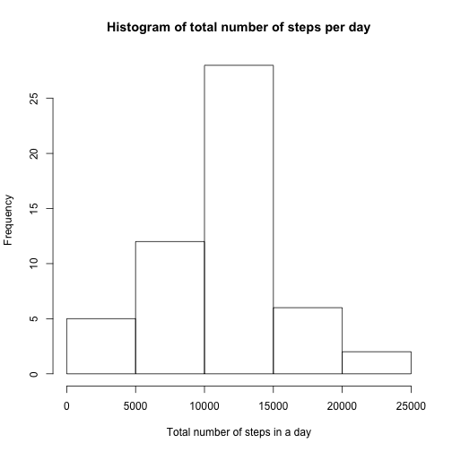
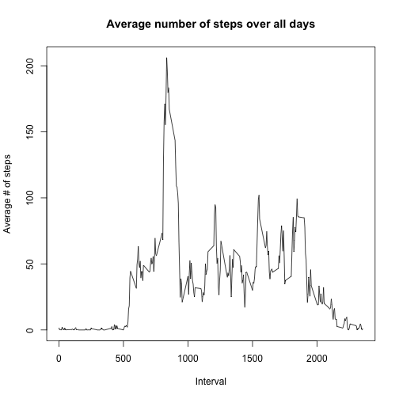
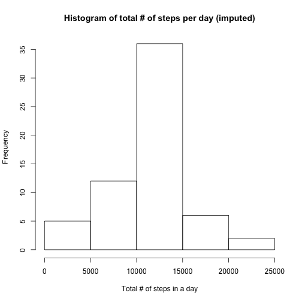
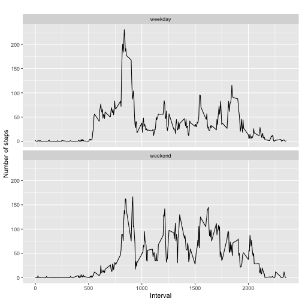

## Loading and preprocessing the data.
Assume that activity.csv is in your current working directory

```r
activity <- read.csv("/Users/mpeters/Desktop/Data Science Course Notes/5_ReprRsch/Project1/RepData_PeerAssessment1-master/activity.csv", sep = ",")
```

## What is mean total number of steps taken per day?


```r
stepsByDay <- group_by(activity, date)
stepsByDaySumm <- summarise(stepsByDay, total = sum(steps))
```

## Make a histogram of the total number of steps taken each day.


```r
hist(stepsByDaySumm$total, main="Histogram of total number of steps per day", ylab = "Frequency",
     xlab="Total number of steps in a day")
```



## Calculate and report the mean and median of the total number of steps taken per day,


```r
mean(stepsByDaySumm$total)
```

```
## [1] NA
```

```r
median(stepsByDaySumm$total)
```

```
## [1] NA
```

## Make a time series plot of the 5-minute interval (x-axis) and the average number of steps taken, averaged across all days (y-axis).


```r
stepsByInterval <- aggregate(steps ~ interval, activity, mean)
plot(stepsByInterval$interval, stepsByInterval$steps, type="l", 
     main="Average number of steps over all days", 
     xlab="Interval", 
     ylab="Average # of steps")
```



## Which 5-minute interval, on average across all the days in the dataset, contains the maximum number of steps?


```r
stepsByInterval[which.max(stepsByInterval$steps),]
```

```
##     interval    steps
## 104      835 206.1698
```

## Calculate and report the total number of missing values in the dataset (i.e. the total number of rows with NAs).


```r
sum(is.na(activity))
```

```
## [1] 2304
```

## Devise a strategy for filling in all of the missing values in the dataset.


```r
activityImputed <- activity
for (i in 1:nrow(activityImputed)) {
    if (is.na(activityImputed$steps[i])) {
        intervalValue <- activityImputed$interval[i]
        stepsValue <- stepsByInterval[
            stepsByInterval$interval == intervalValue,]
        activityImputed$steps[i] <- stepsValue$steps
    }
}
```

## Create a new dataset that is equal to the original dataset but with the missing data filled in.


```r
imputedStepsByDay <- aggregate(steps ~ date, activityImputed, sum)
```

## Make a histogram of the total number of steps taken each day and Calculate and report the mean and median total number of steps taken per day.


```r
hist(imputedStepsByDay$steps, main="Histogram of total # of steps per day (imputed)", 
     xlab="Total # of steps in a day")
```



```r
meanImputedStepsByDay <- mean(imputedStepsByDay$steps)
medianImputedStepsByDay <- median(imputedStepsByDay$steps)

meanImputedStepsByDay <- mean(stepsByDaySumm$total[complete.cases(stepsByDaySumm$total)])
medianImputedStepsByDay <- median(stepsByDaySumm$total[complete.cases(stepsByDaySumm$total)])
```

## Create a new factor variable in the dataset with two levels – “weekday” and “weekend” indicating whether a given date is a weekday or weekend day.


```r
activityImputed['typeOfDay'] <- weekdays(as.Date(activityImputed$date))
activityImputed$typeOfDay[activityImputed$typeOfDay %in% c('Saturday','Sunday') ] <- "weekend"
activityImputed$typeOfDay[activityImputed$typeOfDay != "weekend"] <- "weekday"
```

## Make a panel plot containing a time series plot (i.e. type = “l”) of the 5-minute interval (x-axis) and the average number of steps taken, averaged across all weekday days or weekend days (y-axis). See the README file in the GitHub repository to see an example of what this plot should look like using simulated data.


```r
activityImputed$typeOfDay <- as.factor(activityImputed$typeOfDay) 
imputedStepsByInterval <- aggregate(steps ~ interval + typeOfDay, activityImputed, mean)
```

## Plot it.


```r
qplot(interval, 
      steps, 
      data = imputedStepsByInterval, 
      type = 'l', 
      geom=c("line"),
      xlab = "Interval", 
      ylab = "Number of steps", 
      main = "") +
    facet_wrap(~ typeOfDay, ncol = 1)
```

```
## Warning: Ignoring unknown parameters: type
```



